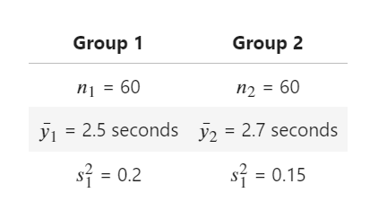
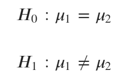
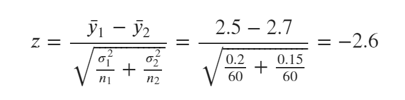
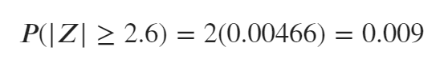
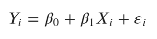
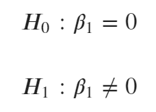

## Introduction of p-value 
In statistics, one of the most common, frequently encountered concepts is the p-value. The p-value  is used for simple statistical tests  such as the t-test  in complicated regression analysis. In statistics, the p-value is technically defined as “the probability of getting results at least as extreme as the ones you observed, given that the null hypothesis is correct”  (Auschwanden, 2015).  The most important use of the p-value is to determine the statistical significance of a hypothesis test. In other words, the p-value determines whether one should reject the null hypothesis. In the real world, the p-value affects the success of predictive models or the publication of articles because the p-value determines the rejection of the null hypothesis. Even if the modeling or study is outstanding, it is difficult to use that model or publish the article without the proper p-value.

## Brief introduction of the hypothesis test
To better understand the p-value, we first need to know what a hypothesis test is. A hypothesis test is used in various fields, such as determining whether a  new drug is more effective than an existing drug or determining whether the coefficients of a regression variable are significant. The researcher usually sets the hypothesis. The null hypothesis states the situation in which there is no difference between two groups (e.g., the effectiveness of a new drug is the same as that of an existing drug). The alternative hypothesis usually states the situation that the researcher wants to prove, and it is typically the opposite of the null hypothesis. If there is a statistically significant difference between the two groups, the researcher should  reject the null hypothesis; thus, the p-value is the key component when a researcher decides whether to reject the null hypothesis.

## Mathematical calculation of the p-value
When we interpret the p-value, the significance level is set first, and it is compared with the p-value to determine whether to reject the null hypothesis. The significance level is usually set as 0.05 or 0.01, with 0.05 considered a stricter condition in a hypothesis test than 0.01. Furthermore, the p-value does not give any indication about the alternative hypothesis because it is calculated assuming that the null hypothesis is correct. 
Typically, the p-value is easily calculated using software such as R, SAS,  or Excel. However, it is good to know how to calculate the p-value to better understand the concept. P-values are derived using the observed value, its distribution, and a test statistic. For a better understanding, I will give a hypothetical example and calculate the p-values. 
Assume that there are two groups and that the experiment will measure how quickly people response to a particular signal. The details are given below.

  

The researcher wants to know whether there is a difference between the response times of men and women and sets up the hypothesis test as shown below.

  

If the null hypothesis is assumed to be correct, the estimator should be the sample mean, and the test statistic is calculated as shown below.

  

Since the test statistic is –2.5, the null hypothesis should be rejected when the absolute value of Z is larger than 2.5. Hence, the p-value could be calculated as below.

  

## Interpretation of the p-value in a hypothesis test
When we interpret the p-value, the significance level is set first, and it is compared with the p-value to determine whether to reject the null hypothesis. The significance level is usually set as 0.05 or 0.01, with 0.05 considered a stricter condition in a hypothesis test than 0.01. Furthermore, the p-value does not give any indication about the alternative hypothesis because it is calculated assuming that the null hypothesis is correct. 
When the p-value is smaller than the significance level, the researcher should conclude that there is statistically significant evidence to reject the null hypothesis at that significance level. However, if the p-value is larger than the significance level, the researcher should conclude that there is no statistically significant evidence to reject the null hypothesis. 
## Real-world example
Due to the world economic crisis in 2009, banks had substantial difficulty  paying back their loans, and the International Financial Reporting Standards (IFRS) required a stricter methodology for credit risk management.  
Suppose a bank wanted to investigate the relationship between macro-economic variables and the probability of default (PD) for its customer. After quantitative  consideration of macro-economic variables, the risk manager of the bank finds that the unemployment rate is a meaningful variable, and they try to investigate the relationship between the unemployment rate and the PD using historical data.  
In this situation, the risk manager could use simple regression analysis and set up the regression as below. 

  

Then, the null hypothesis (H0) states that there is no relationship between the PD and the unemployment rate, and the alternative hypothesis (H1) states that there is a relationship between the PD and the unemployment rate, as described below.

 

  

If the p-value of β_1 is 0.02 and the significancet level is 0.05, there is statistically significant evidencet to reject the null hypothesis at that significancet level, and the risk manager could should conclude that the PD are is related with to the unemployment rate at the 0.05 significancet level. Furthermore, the risk manager could say that assuming that there is no relationship between the PD and unemployment rate, they would obtain the observed the relationship between the PD and unemployment rate in 2% of studies due to random sampling error.

## Takeaways
- A p-value is used to determine whether to reject the null hypothesis.
- When the p-value is less than the significance level, the null hypothesis is to be rejected; otherwise, the null hypothesis cannot be rejected.
- Since the p-value is calculated based on the assumption that the null hypothesis is correct, it reveals nothing about the alternative hypothesis.

## Reference
1. Aschwanden, C. (2015, November 24). Not Even Scientists Can Easily Explain P-values. FiveThirtyEight. https://fivethirtyeight.com/features/not-even-scientists-can-easily-explain-p-values/. Retrieved March 2, 2021. 
